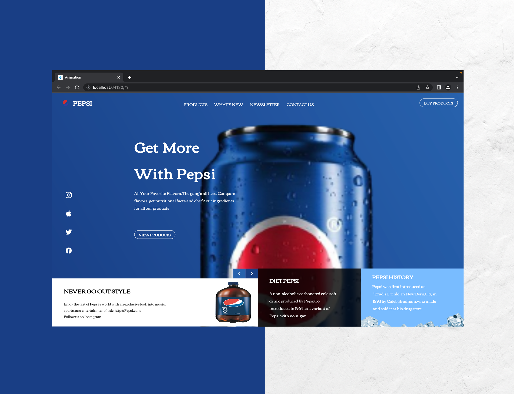

# 🔥🔥 Flutter Web Pepsi UI  

I replicated a simple pepsi web page with Flutter Web, i got the UI inspiration from @antonsuprunenko on Instagram

Star⭐ the repo if you like what you see😉.

#Screenshots

## 🤓 Author(s)
**Charly Keleb Charles042** 

## Getting Started

This project is a starting point for a Flutter application.

A few resources to get you started if this is your first Flutter project:

- [Lab: Write your first Flutter app](https://flutter.dev/docs/get-started/codelab)
- [Cookbook: Useful Flutter samples](https://flutter.dev/docs/cookbook)

For help getting started with Flutter, view our
[online documentation](https://flutter.dev/docs), which offers tutorials,
samples, guidance on mobile development, and a full API reference.
